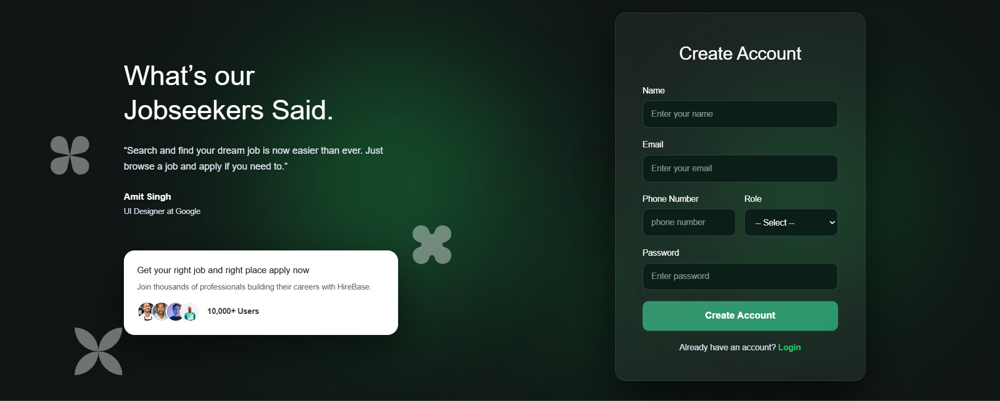
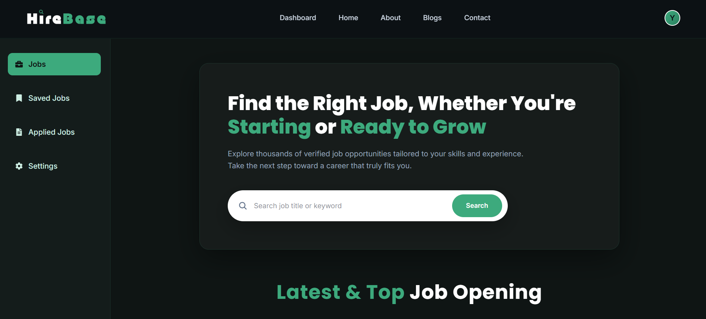

# HireBase – Job Portal Frontend

HireBase is a full-stack job portal designed to simulate real-world hiring workflows between candidates and employers.

This repository contains the frontend built with React.js, focusing on performance, clean UI, and role-based user experience.

---

## 📸 Screenshots

### Sign Up Page


### Login Page


### Home


### Dashboard


---

## 🛠 Tech Stack

- React.js  
- React Router  
- Axios  
- Framer Motion  
- CSS3  
- React Icons  

---

## ✨ Features

### 🔐 Authentication & Access Control
- User signup and login  
- JWT-based authentication  
- Protected routes  
- Role-based access (Candidate & Employer)  
- Separate layouts for different user roles  

---

### 💼 Candidate Functionality
- Browse all jobs  
- Search and filter jobs (city & industry)  
- Apply to jobs  
- Save jobs for later  
- Manage profile & settings  

---

### 🏢 Employer Functionality
- Dashboard with structured sections:
  - Jobs (view all jobs)
  - Companies (search & manage companies)
  - Post Jobs (create & manage listings)
  - Applicants (view candidates who applied)
- View detailed applicant data  

---

### ⚡ Performance & UX
- Skeleton loaders for better perceived performance  
- Smooth animations using Framer Motion  
- Fully responsive design  
- Clean and reusable component architecture  

---

### 🛡️ Error Handling & Stability
- Custom 403 Forbidden page  
- Custom 404 Not Found page  
- Axios interceptors for API handling  

---

---

## Installation

### 1. Clone the repository

```bash
git clone https://github.com/YashSinghal02/HireBase-Frontend.git
```

### 2. Navigate into the project folder

```bash
cd HireBase-Frontend
```

### 3. Install dependencies

```bash
npm install
```

### 4. Start the development server

```bash
npm run dev
```

---

## 🔗 Backend

The frontend communicates with a separate backend that handles server-side functionality including authentication, messaging, user management, image uploads, and email services.

**Backend Repository:**
https://github.com/YashSinghal02/ChitChatBackend

---

## 📁 Project Structure

```bash
src/
├── components
├── pages
├── assets
├── api
├── hooks
├── context
└── utils


```

---

## License

This project is licensed under the MIT License.

Copyright (c) 2026 Yash Singhal

---

## Author

Yash Singhal
Aspiring Full Stack Developer specializing in the MERN stack.
